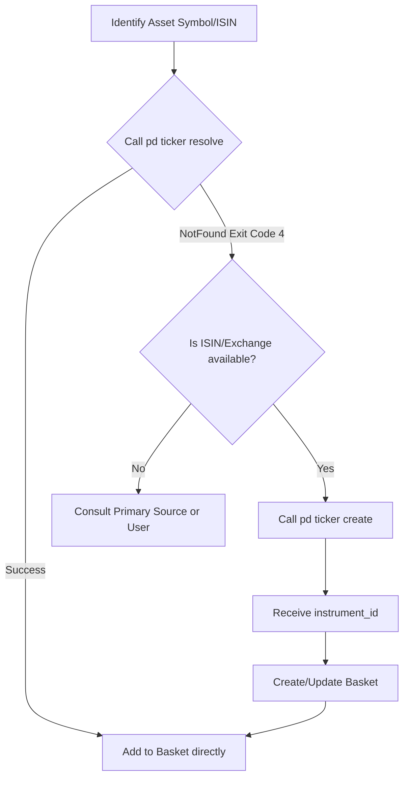

# Pattern: Robust Ticker Resolution & Registration

When constructing investment theses, analysts and automated agents frequently identify niche proxy assets or upstream bottleneck monopolists that do not yet exist in the PortDive server database. 

This pattern outlines the standard **resolve-or-create** workflow to ensure no high-signal assets are skipped or omitted from baskets due to resolution blockages.

---

## The Resolve-or-Create Pipeline

Before adding any position to a Tradable Basket or a Health Basket, follow this checklist:



---

## 1. Step-by-Step Execution

### Step A: Attempt Standard Resolution
Always attempt to resolve the asset using the canonical CLI resolution mechanism first. Specify either the `--symbol` (with optional `--exchange` to disambiguate) or the unique `--isin`:
```bash
pd ticker resolve <SYMBOL> [--exchange <EXCHANGE>]
# OR
pd ticker resolve --isin <ISIN>
```
* **Success**: If it returns an `instrument_id`, proceed directly to Basket Addition.
* **NotFound (Exit Code 4)**: If the command fails with exit code `4` (NotFound), the asset is not registered on the server. Move to Step B.

### Step B: Idempotent Registration
If the ticker is missing, register it in the canonical universe using `pd ticker create`. This command requires the symbol, exchange, and ISIN:
```bash
pd ticker create <SYMBOL> --exchange <EXCHANGE> --isin <ISIN> [--name "<FULL_NAME>"] [--wkn <WKN>]
```
* **Implication**: This registers the asset, returns a canonical `instrument_id`, and automatically schedules asynchronous background OHLCV and indicator ingestion.
* **Example**:
  ```bash
  pd ticker create NOVC --exchange XETR --isin DK0062498110 --name "Novo Nordisk A/S" --wkn A1XA83
  ```

### Step C: Basket Association
Do not let basket operations block on unregistered assets. Once Step B returns the `instrument_id`:
1. Ensure the target basket exists (or create one using `pd basket add --thesis <THESIS_ID> --name "<BASKET_NAME>"`).
2. Add the registered position immediately:
   ```bash
   pd basket items add <BASKET_ID> --symbol <SYMBOL> --exchange <EXCHANGE> [--weight-pct <PCT>] [--rationale "<RATIONALE>"]
   ```

---

## 2. Common Pitfalls to Avoid

* **Phantom Basket Assets**: Do not document an asset weight in the local `THESIS.md` markdown table unless you have successfully paired it on the server using the resolve-or-create pipeline. Stale or phantom weights violate the [Server-Is-Canonical](../doctrine/server-is-canonical-for-theses.md) doctrine.
* **Missing Exchanges**: When registering a new ticker, do not omit the `--exchange` flag. Disambiguating the trading venue is critical for correct price feed ingestion and currency risk calibrations.
* **Skipping Baskets due to Resolution Failures**: An agent must never skip basket construction because a ticker fails to resolve. The agent has the power to call `pd ticker create` and complete the pairing loop autonomously.
