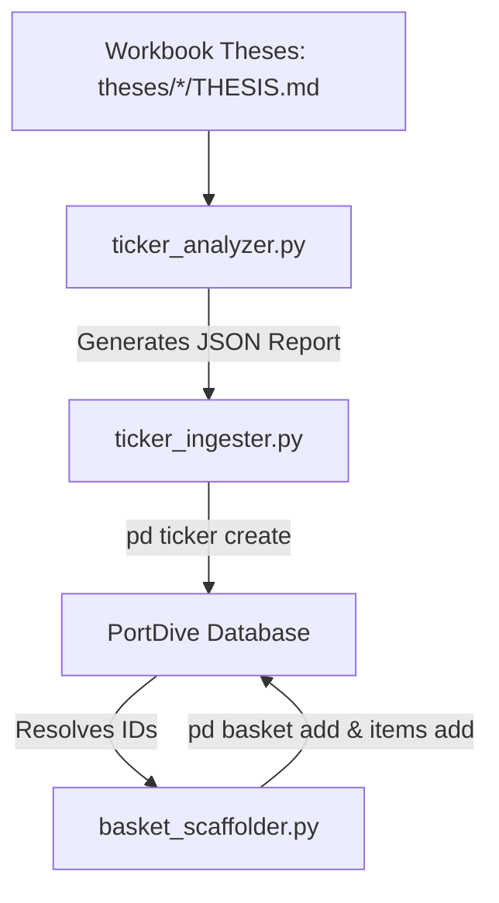

# Reference: Workbook Ingest & Sync Toolkit

This document outlines the architecture, usage, and orchestration guide for the PortDive **Ingestion & Syncing Toolkit** located inside the `./scripts/` directory. These tools are designed to streamline scanning markdown theses, registering missing instruments, and scaffolding baskets dynamically in the PortDive gRPC database.

---

## 1. Toolkit Architecture

The toolkit consists of three generalized Python command-line tools that run sequentially as a pipeline:



1. **`scripts/ticker_analyzer.py`** — Walks `theses/*/THESIS.md` and extracts all active proxies and health items, normalizes identifiers, and checks their presence in the database.
2. **`scripts/ticker_ingester.py`** — Consumes the analyzer's JSON report, filters for missing tickers, applies canonical data corrections, programmatically registers them, and verifies resolution.
3. **`scripts/basket_scaffolder.py`** — Walks `THESIS.md` files, resolves database instrument IDs, programmatically scaffolds Core and Health baskets on the server, and populates positions with weights, roles, and rationales.

---

## 2. Command Reference

### A. Ticker Analyzer (`ticker_analyzer.py`)

Scans all active theses to identify missing or mismatched tickers.

```bash
python3 scripts/ticker_analyzer.py [OPTIONS]
```

**Options:**
- `--root <path>` — Path to the theses directory (default: `./theses`).
- `--output <file>` — Path to export the structured JSON report (default: `./scripts/outputs/analyzer_report.json`).
- `--check-db` — Query the live database via `pd ticker resolve` to detect if tickers are already registered.

**Example usage:**
```bash
python3 scripts/ticker_analyzer.py --check-db
```

---

### B. Ticker Ingester (`ticker_ingester.py`)

Registers missing tickers programmatically, applying built-in corrections for known workbook discrepancies.

```bash
python3 scripts/ticker_ingester.py [OPTIONS]
```

**Options:**
- `--input <file>` — Path to the JSON report generated by the Ticker Analyzer (default: `./scripts/outputs/analyzer_report.json`).
- `--dry-run` — Print the planned registry commands without executing them.
- `--verify-only` — Perform gRPC resolution tests by resolving ISINs for all tickers in the report without creating new ones.

**Built-In Corrections:**
The tool automatically intercepts and corrects known typos to ensure data integrity:
- **TOWA Corp (`6315.T`)** ISIN typo (`JP3596800009` Salomon shoe SKU) → corrected to **`JP3555700008`**.
- **Kokusai Electric (`6525.T`)** ISIN typo (`JP3283470000`) → corrected to **`JP3293330001`**.
- **Vistra Corp (`VST`)** WKN typo (`A2DJ9W`) → corrected to **`A2DJE5`**.
- **Astera Labs (`ALAB`)** ISIN/WKN typos → corrected to ISIN **`US04626A1034`** and WKN **`A404AF`**.
- **Silicon Motion (`SIMO`)** WKN typo (`A0DLDM`) → corrected to **`A0ETU4`**.

**Example usage:**
```bash
python3 scripts/ticker_ingester.py --dry-run
python3 scripts/ticker_ingester.py
```

---

### C. Basket Scaffolder (`basket_scaffolder.py`)

Scaffolds server baskets dynamically and maps all proxies and health items to their database IDs.

```bash
python3 scripts/basket_scaffolder.py [OPTIONS]
```

**Options:**
- `--root <path>` — Path to the theses directory containing paired `THESIS.md` files (default: `./theses`).
- `--dry-run` — Display planned gRPC basket and item additions without executing them.

**Example usage:**
```bash
python3 scripts/basket_scaffolder.py --dry-run
python3 scripts/basket_scaffolder.py
```

---

## 3. Operational Doctrines

- **Database Cleanliness First**: Always run the Ticker Analyzer with `--check-db` before trying to ingest new tickers. This avoids unique key violations or duplicate registrations.
- **Dry-run Validations**: Before initiating any batch write transactions (ingester or scaffolder), execute the commands with the `--dry-run` flag to audit the planned diff.
- **Data-feed Delisting Policies**: If a stock is delisted/privatized (like *Shinko Electric*), it must still be registered under its historical exchange symbol to preserve historical briefings and correlation logs.
